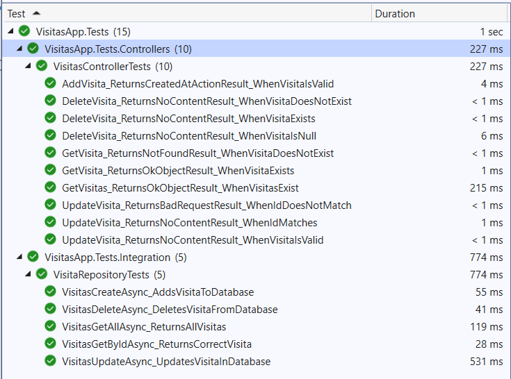
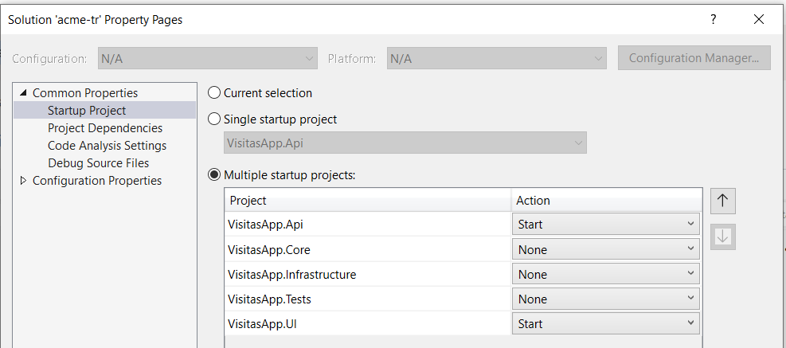
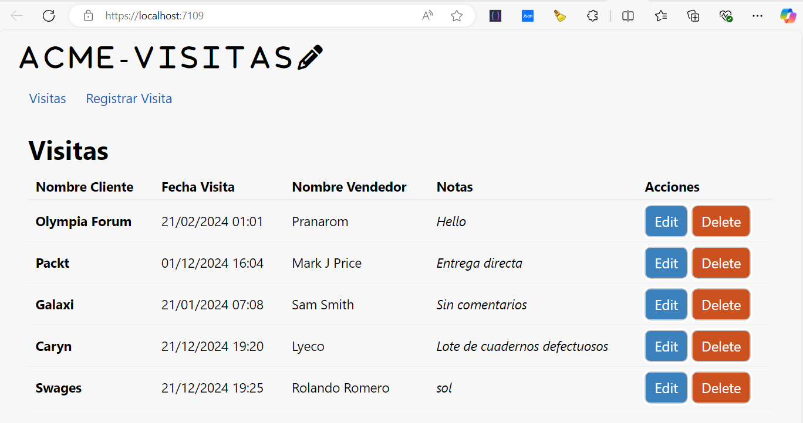
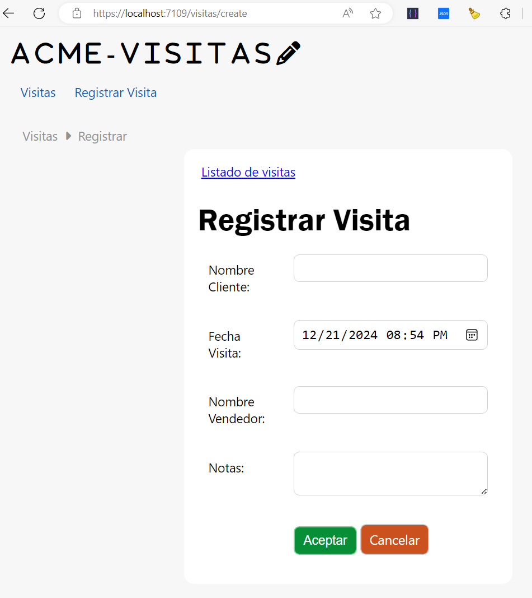
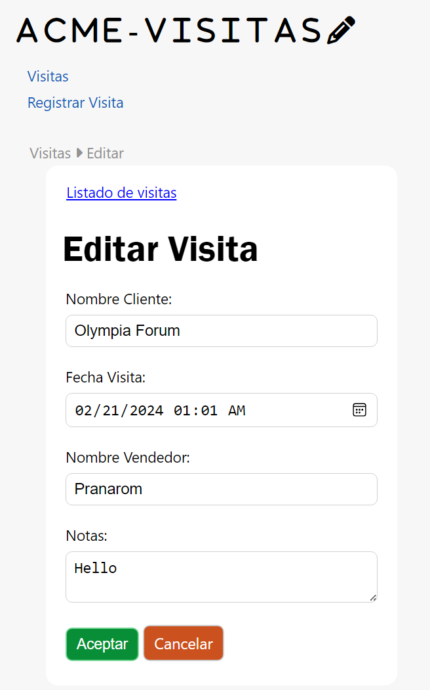
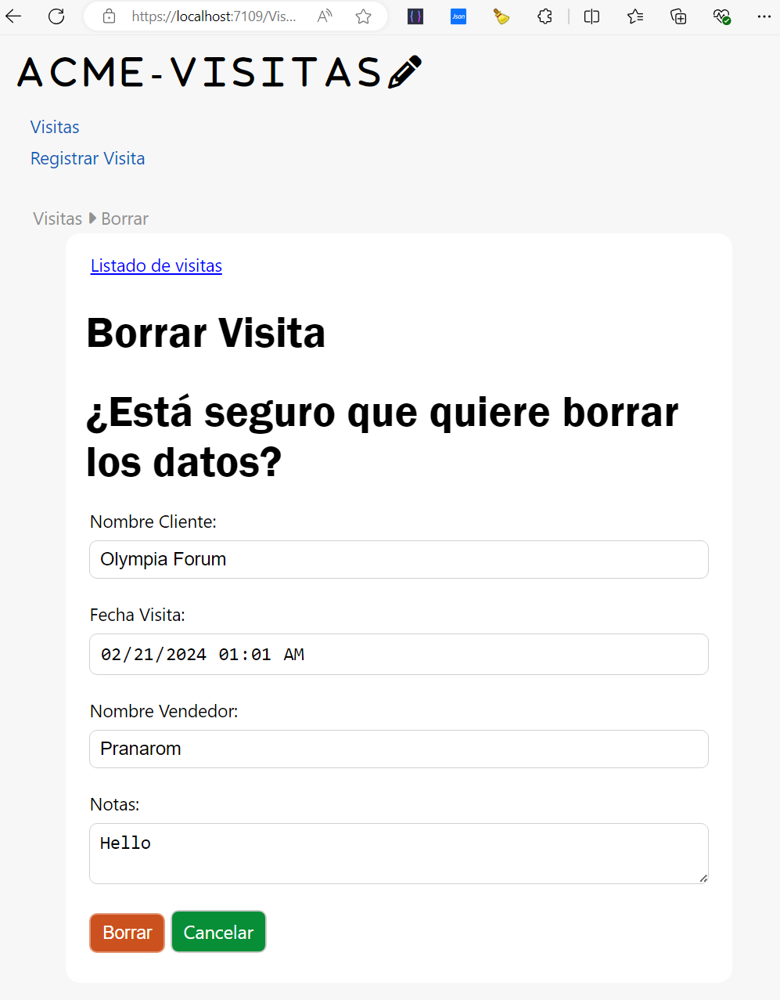

# ✏ acme-tr
Prueba Especialista .NET

## El problema:
ACME, es una empresa que se dedica a vender **productos de oficina**.
Los comerciales del departamento de marketing salen a la calle a ofrecer los productos y registran las visitas en una hoja de excel que esta compartidad para todo el departamento.

 

## Crea una solución:
Donde se pueda visualizar, añadir, editar y eliminar:
- Cliente visitado
- Fecha visita
- Comercial responsable
- *... y demás datos que consideres necesarios.*

------
# 🌱Diseño con Clean Architecture

- Solución en .NET Core
- Entity Framework
- ASP.NET Core API
- BBDD SQL Server
- T-SQL stored procedures para las operaciones CRUD
- Pruebas Unitarias xUnit

A continuación vamos paso a paso para construir la solucion.
-----
#### 1. Estructura de la solución

- ***VisitasApp.Api:*** Proyecto de la API para la operaciones CRUD
- ***VisitasApp.Core:*** Proyecto de la capa de dominio
- ***VisitasApp.Infrastructure:*** Proyecto de la capa de acceso a datos
- ***VisitasApp.UI:*** Proyecto de la capa de presentación
- - ***VisitasApp.Test:*** Proyecto de pruebas unitarias
----

#### 2. Crear la base de datos usando EF *model first*

- **VisitasApp.Infrastructure\TSqlScripts**: Directorio para los SPs que entran en la migración
- **VisitasApp.Infrastructure\Migrations**: Directorio para las migraciones

> #### Conexión de la base de datos 
```json
"ConnectionStrings": {
    "DefaultConnection": "Server=(localdb)\\mssqllocaldb;Database=VisitasAppDb;Trusted_Connection=True;MultipleActiveResultSets=true"
  },
```

> #### Comando para ejecutar la migración
```bash
dotnet ef database update -p VisitasApp.Infrastructure -s VisitasApp.Api
```

-----

#### 3. Crear .NET API para las operaciones CRUD

> **Ruta de la API:**  *http://localhost:5020*

> 

-----
#### 4. Pruebas unitarias

- **VisitasDbContextTest:** Proporciona una **capa de abstracción** para interactuar con la base de datos en pruebas unitarias, permitiendo realizar operaciones CRUD en la tabla **Visitas**.
- **VisitasControllerTest:** Pruebas unitarias para el controlador de la API.
- **VisitasRepositoryTest:** Pruebas unitarias para el repositorio de la API.

> 


-----
## Iniciar la aplicación

1. **Descargar** el repositorio 
> 💾 **[https://github.com/gulydesousa/acme-tr](https://github.com/gulydesousa/acme-tr)**

2. **Configurar** la conexion al servidor sql en la API 
> 👨‍💻`visitasApp.Api\appsettings.json`

3. **Ejecutar la migración** de *Base de Datos* desde el directorio de la solución
> 🛢 Modelo de datos
```bash
dotnet ef database update -p VisitasApp.Infrastructure -s VisitasApp.Api
```
4. Al arrancar la solución se inicia la web y la api simultaneamente  
> ⚙Asegurarse que la solución tiene la opcion **Multiple Start Up Projects** con estos dos proyectos seleccionados: `VisitasApp.Api`, `VisitasApp.UI`


<br>

<style>
table td {
    vertical-align: top;
}
</style>
<table>
<tr>
<td>Index<br>
</td>
<td>Create</br>
</td>
</tr>
<tr>
<td>Edit</br>
</td>
<td>Delete</br>
</td>
</tr>
</table>


